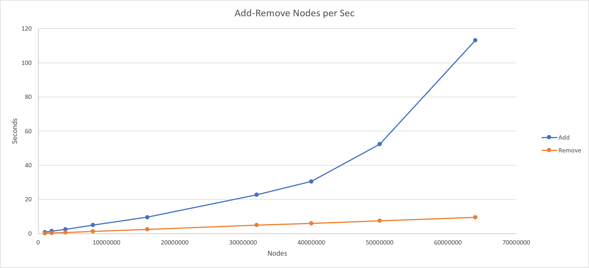

# Hashtree
A hybrid data structure that uses a Dictionary that references nodes within the tree. The nodes contain a dictionary key reference to their parent and their children. This data structure has O(1) CRUD.

## Approach, API & Efficiency

### API and Approach

#### Class Hashtree Required Classes
- Hashtree requires TreeQueue class and Node class.

#### API Method Descriptions and Approach

TreeQueue Class
- A double linked list I built to act like a queue with regular Dequeue, Peek and Enqueue Methods but it also contains a GrabFront method that allows it to return the youngest value in the queue and remove that value from the TreeQueue. This method was nessecary for the Delete method to maintain O(1) time.
  
Node Class
- Attributes
  - int Parent (Key reference to node's parent.)
  - int Left (Key reference to node's left child.)
  - int Right (Key reference to node's right child.)
  - object Value (generic payload of node.)

- Constructor Method
  - Input = int key, object value
  - Creates a new Node with a Left, Right, and Parent value of 0 which designates a null reference.
  - Key = key (Auto Assigned by Hashtree)
  - Value = value (Generic Value)
    

Hashtree Class
  - Attributes
    - int Size (Total amount of Nodes present in Hashtree)
    - int NextKeyValue (Used to make sure that every node has a unique key value)
    - Dictionary(Vertex, LinkedList(Edge)) Storage (Holds all of the Node.Keys as the Key values and the Node as a Value)
    - TreeQueue CanAdd (Used to keep track of the Key reference of the next avaliable Node that has a null child. This allows O(1) write. Also note that nodes will always add from left to right.)
    - int Root (Reference to the key value of the root node within the tree.)

  - Constructor Method
    - Creates the Storage. 
    - Creates the CanAdd queue.
    - Sets the Size of the Hashtree to 0.
    - Sets the initial NextKeyValue to 1. (This allows me to consider a key value of 0 to indicate a null node)
    
  - Add Method
    - Input = int value.
    - Output = void.
    - Creates a new Node called temp that uses the Hashtree's NextKeyValue as the node's Key value and uses the input object "value" as the node's Value.
    - Checks to see if the Root == 0 which would indicate that the tree is empty.
      - if Root == 0 is true. 
        - Sets the Root to temp.Key. 
        - Adds temp.Key to CanAdd (Since it has a null left and right child its avaliable to accept new nodes.)
        - Adds the node to storage using temp.Key as the key and temp as the value.
      - else
        - Passes the temp node to AddHelper method.
    - Increases the Size of the Hashtree by 1.
    - Increases the NextKeyValue by 1.

  - AddHelper Method
    - Input = Node temp
    - Output = void
    - Grabs the leftmost leaf from the Tree by accessing the Hashtree's Storage using the oldest value in the TreeQueue. This is accomplished by using the CanAdd.Peek() method. It sets this Node to Node current.
    - Now that Node current has been retreived we check to see if current has a null left child.
    - If left is null (current.Left == 0)
      - current.Left is set to temp.Key.
      - temp.Parent is set to current.Key.
    - Else
      - current.Right is set to temp.Key.
      - temp.Parent is set to current.Key.
    - If the Storage doesn't already contain the temp node then the temp node is added to storage.
    - The temp.Key is then added to the CanAdd queue.
    - Then a check is conducted of the current node's children.
      - If both children are not null then current.Key is removed from the CanAdd queue.
  - Remove Method
    - Input = int keyValue
    - Output = void
    - If the keyValue is not found within storage then the method ends.
    - The node that will be removed is then accessed from Storage using the input keyValue as Node current.
    - If current is the Root then the method ends. (Currently I am not allowing the root to be deleted.)
    -Node current is then removed from Storage.
    -Node current.key is then removed from CanAdd.
    -Node currents relative nodes parent, left, and right are then retreived.
    - #### Remove edge cases. Improves time optimization.
    - If the current node is a left leaf
      - Sets the parent.Left's value to 0 (null).
    - If the current node is a right leaf
      - Sets the parent.Right's value to 0 (null).
    - If the current node has a left child but not a right child.
      - If the parent.Left is equal to current.Key
        - parent.Left = left.Key.
      - else parent.Right = left.Key
      - left.Parent then gets set to parent.Key.
    - If the current node has a right child but not a left child.
      - If the parent.Left is equal to current.Key
        - parent.Left = right.Key.
      - else parent.Right = right.Key
      - right.Parent then gets set to parent.Key.
    - #### Remove non-edge cases. (interior node is being deleted)
    - If current's left and right nodes are both populated.
      - The most recently created leaf is accessed from CanAdd using the CanAdd.GrabFront method. 
      - The retreived node is then inserted into the deleted nodes position and its relative values (parent, left and right are updated between all nodes.)
    - Size is reduced by 1.
  - Read Method
    - Input: int keyValue (Node's key value)
    - Output: 
    - Accesses Node from storage using keyValue input.
    - Returns Node's Value (object)
  - Update Method
    - Input: int keyValue (Node's key value), object updateValue (Node's new Value)
    - Output: void
    - Accesses Node from storage using Key input.
    - Modifieds retreived Node's value using updatedValue
  - ReadAll Method
    - Conducts a breadth first traversal of tree and returns an in order List of all of the nodes Values (objects)
    
### Efficiency

This graph displays the Add and Remove time efficiency of a mass add or remove. The benchmarking was done by running a for loop with a .Add(i) within the loop. This graph does not represent the efficiency of the addition or removal of a single node from the tree. The lograrithmic trend of the Add method is not due to a O(log n) time efficiency even though Add speed is reducing as a larger collection of nodes are added but instead is a bottleneck caused by the time it takes for the tree to write to memory. I think that this is probably caused by the logarithmic nature of a binary tree. For every level that is completed in the tree the amount of memory being used doubles whitch is reflected as a logarithmic curve.

#### Add Method
##### Time
O(1)
##### Space
O(1)

#### Remove Method
##### Time
O(1)
##### Space
O(1)

#### Read Method
##### Time
O(1)
##### Space
O(1)

#### Update Method
##### Time
O(1)
##### Space
O(1)

#### ReadAll Method
##### Time
O(W)
#### Space
O(W)

#### Add Method
##### Time
O(1)
##### Space
O(1)

